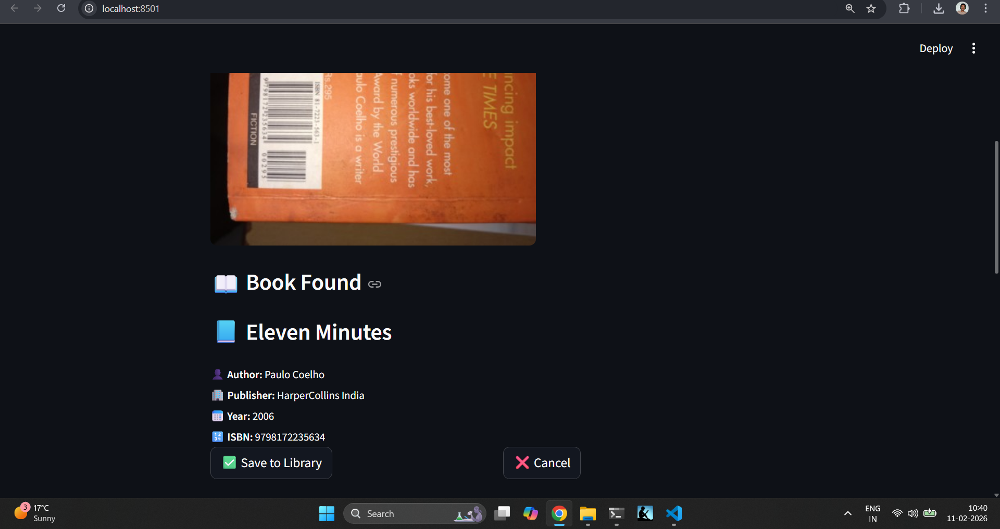

  

# 📚 Personal Library Scanner

A project I built to bridge my physical bookshelf with a digital library.

I wanted something faster and more natural than manually typing book details — so I designed a pipeline that goes from **image → ISBN → metadata → database**.

This project is as much about system design and data validation as it is about the interface.

---

## 🔍 What This App Does

* Scans a book’s ISBN from a barcode image using **pyzbar**
* Falls back to **OCR (Tesseract)** when barcode detection fails
* Validates ISBN‑13 using checksum logic
* Fetches book metadata from:

  * Google Books API
  * Open Library API (fallback)
* Stores books in a local **SQLite** database
* Prevents duplicate entries with a **UNIQUE ISBN constraint**
* Provides a **Streamlit interface** to:

  * Upload barcode images
  * Review book details before saving
  * Search by title, author, or ISBN
  * Delete books from the library

---

## 🧠 Design Philosophy

Rather than building just a UI, I focused on creating a clean, modular architecture.

**UI (Streamlit)**
↓
**Pipeline (application logic)**
↓
**Services (Barcode + OCR + APIs)**
↓
**Database (SQLite)**

Each module has a single responsibility:

* `streamlit_app.py` → User interaction
* `pipeline.py` → Coordinates scanning & storage logic
* `barcode.py` → Barcode decoding
* `ocr.py` → OCR-based ISBN extraction
* `app.py` → External API communication
* `database.py` → Schema & CRUD operations

This separation keeps the system easy to debug, extend, and reason about.

---

## 🧪 ISBN Validation Strategy

OCR output is often messy and unreliable.

To prevent corrupt or invalid entries:

1. A regex pattern detects ISBN-like sequences
2. Text is normalized to digits only
3. ISBN‑13 checksum verification confirms validity

This ensures random 13‑digit numbers don’t pollute the database.

---

## 🛠 Tech Stack

* Python
* OpenCV
* pyzbar
* pytesseract
* SQLite
* Streamlit
* Requests

---

## 🌐 Live Demo

You can try the app here:

👉 **[Personal Library Scanner – Live App](https://pesonal-library-scanner-plgfiyv5adwj58gvcdmdns.streamlit.app/)**

The demo allows you to:

• Upload a barcode image
• See extracted ISBN + metadata
• Save books to the database
• Search your library
• Delete ent

## 🚀 Running the App Locally

1️⃣ Install dependencies:
  pip install -r requirements.txt

2️⃣ Launch Streamlit:
  streamlit run streamlit_app.py

3️⃣ Upload a barcode image and scan.

## 📌 Why I Built This

I built this primarily for myself.

I have a growing personal physical library, and manually entering book details felt inefficient and error‑prone. Scanning barcodes felt like a more natural and scalable solution.

At the same time, this project became a practical exercise in:

* Working with computer vision tools
* Handling noisy OCR output
* Implementing checksum-based validation
* Designing a layered application architecture
* Integrating external APIs with a local database

So while it solves a personal need, it also reflects how I think about building reliable systems — not just interfaces.